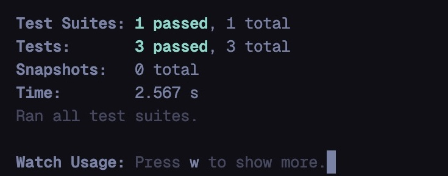

# Frontend Developer Çalışması

## Genel Kriterler: 
- Çalışma içinde yapılacak save / load işlemlerinin localStorage’a kaydedilmesi gerekmektedir.
- Uygulama içerisinde en az 1 servis isteği yapılmalıdır.
- Çalışmanın görsel tasarımı için istenilen kütüphane kullanılabilir.
- Çalışma responsive design kurallarına uygun olarak yapılmalıdır.
- Yapılacak çalışmada en az 2 ayrı sayfa olmalıdır.
    - Ürün Liste Sayfası
    - Ürün Detay Sayfası
- Çalışma için <b>Unit</b> test yazılmalıdır.

## Çalışma için tamamlanması gereken işler: 
- [x] Uygulama, listeleme ekranı ile başlamalıdır. 
- [x] Listenecek olan elemanlar [şu adres](https://5fc9346b2af77700165ae514.mockapi.io/products) üzerinden çekilip ekrana basılacaktır. 
- [x] Ürünler 12’şer adet olarak ekranda gösterilmelidir. 12’den fazla ürün varsa pagination özelliği eklenmelidir.
- [x] Listelenen ürünlerden biri seçildiğinde, o ürünün detaylarının bulunduğu ekrana yönlendirilecek ve ürün detayları gösterilecektir.
- [x] Ekranda bulunan “add to cart” butonuna basarak sepete ürün eklenmelidir.
- [x] Sepet alanında(en sağdaki bulunan alan) ürün sayısı arttırılıp azaltılabilmeli ve bu güncellemelere göre sepette güncellenmelidir.
- [x] Sepete eklenen ürünler, browser’ı kapatılsa bile tekrar açıldığında kaldığı yerden devam edebilmelidir.
- [x] Ekranın sol tarafında bulunan filtreler ile filtreleme işlemi yapılabilmelidir.
- [ ] Header alanında bulunan “Search“ alanı ile tüm ürünler arasında isim ile arama yapılıp, aşağıdaki liste güncellenmelidir.
- [x] Ürünlerden herhangi birinin üzerine tıklandığında “Ürün Detay” ekranına gidebilmeli ve sepete ekleme işlemi bu alandan da yapılabilmelidir.
- [x] Redux, Redux-Saga, ContextApi vb. kullanılması avantajlı olacaktır.

## Ekran Görüntüleri

## Test

